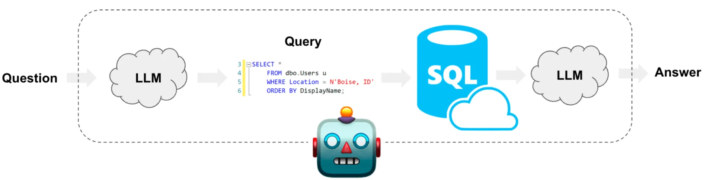

# Chat with Database  
[Try it here](https://chat-with-database-4.onrender.com)

This project implements a chat interface for interacting with any database using daily natural languages. Leveraging the GPT-4 model from OpenAI, it translates user queries into SQL commands, executes them in a database, and returns the results in a user-friendly format.  

## Project Overview  
This application is divided into two main parts:  

### Frontend  
The frontend is built with React to create a user-friendly interface for interaction. It consists of three main directories:  

1. **Home**
   - Displays the main chat interface.  
   - Accepts user input and displays the database query results in real time.  

2. **Description**  
   - Explains how the project operates and its features.  

3. **Developer**  
   - Contains information about the developers or any related technical notes.  

### Backend  
The backend is powered by Flask and relies on OpenAI's GPT-4 API to process natural language queries, convert them into SQL, and interact with the database.  

---

## Idea Behind the Scene  
The system works as follows:  
1. Users input their questions or queries in natural language.  
2. The backend processes these inputs using GPT-4 to generate SQL queries.  
3. The generated SQL queries are executed on the database.  
4. Results are formatted and displayed to the user in an easy-to-read format.  

  

---

## References  
1. [Chat With a MySQL Database Using Python and LangChain](https://alejandro-ao.com/chat-with-mysql-using-python-and-langchain/)  
2. [ How to Chat with an SQL Database Using LLM](https://codoid.com/ai-testing/mastering-llm-and-sql-expert-tips-for-database-chat/)  

